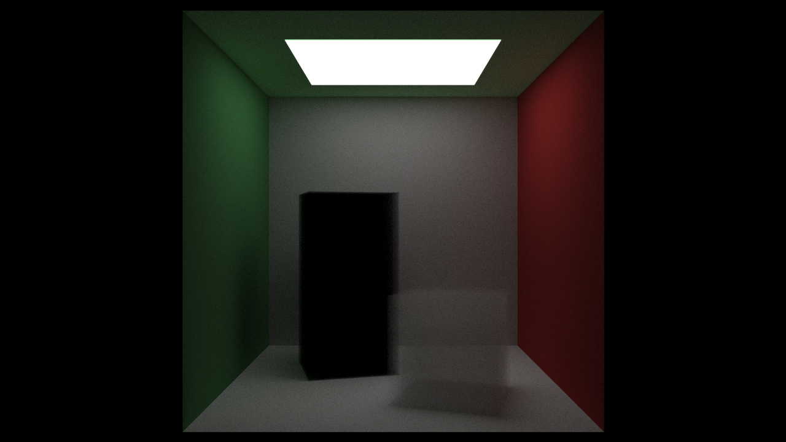

# Raytracing

Implementation of "Raytracing in one weekend" and "The next week" by Peter Shirley (http://in1weekend.blogspot.com/2016/01/Ray-tracing-in-one-weekend.html)

Partially inspired from this excellent article "Accelerated Ray Tracing in One Weekend in CUDA" by Roger Allen (https://devblogs.nvidia.com/accelerated-ray-tracing-cuda/)

## How to compile and run

Since this uses CUDA you will need nvcc.

`nvcc ./src/main.cu -I ./src -o test && time ./test 1920 1080 50 out.png && feh out.png`

